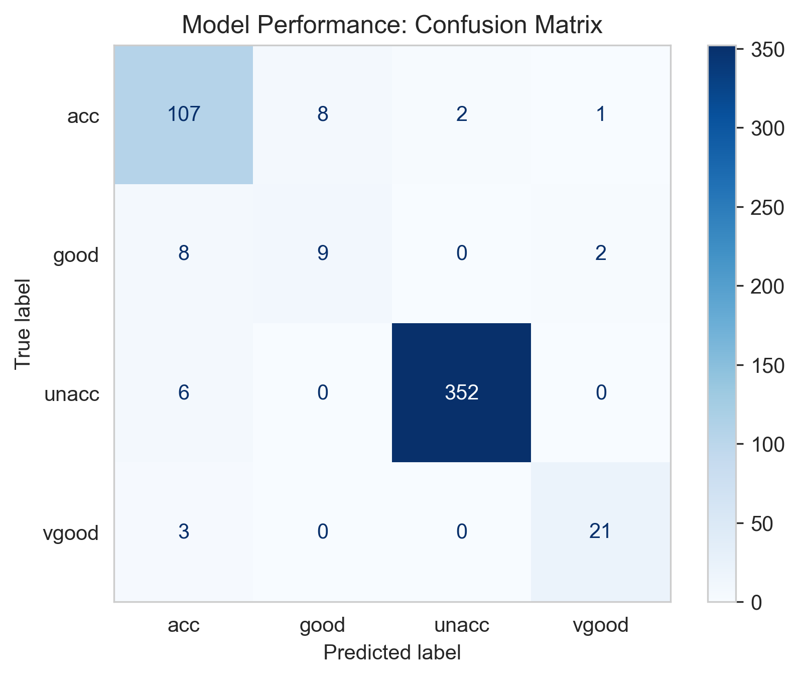
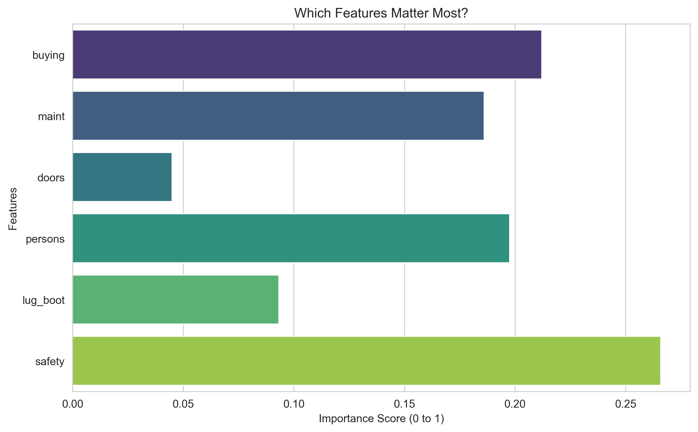
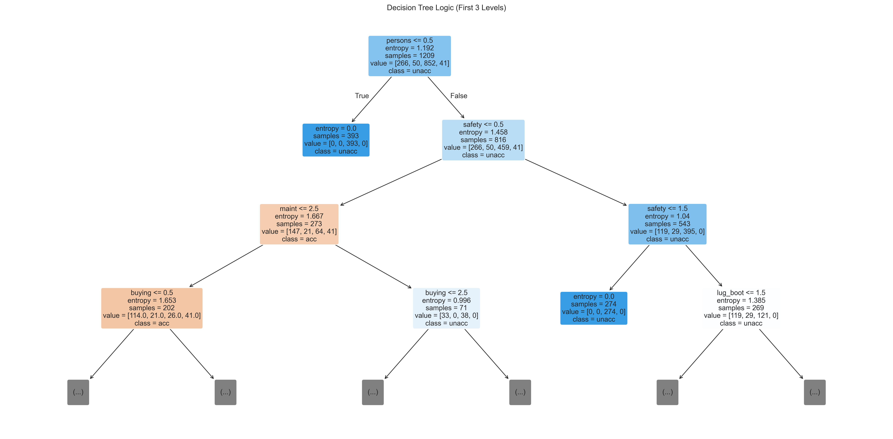

# 🚗 Car Evaluation Classification Project


## 📌 Project Overview
This project builds a Machine Learning model to predict the **acceptability** of a car based on its technical specifications and price. 

The goal is to classify cars into four categories: **Unacceptable, Acceptable, Good, Very Good**. 

To ensure a robust and production-ready solution, a **Scikit-Learn Pipeline** was implemented along with **GridSearchCV** for hyperparameter optimization, preventing data leakage and overfitting.

## 📂 Dataset
The dataset is sourced from the **UCI Machine Learning Repository**.
It consists of **6 attributes** describing the car:

* **buying:** Buying price (vhigh, high, med, low)
* **maint:** Maintenance price (vhigh, high, med, low)
* **doors:** Number of doors (2, 3, 4, 5more)
* **persons:** Capacity in terms of persons to carry (2, 4, more)
* **lug_boot:** Size of luggage boot (small, med, big)
* **safety:** Estimated safety of the car (low, med, high)
* **Target (Class):** unacc, acc, good, vgood

## ⚙️ Methodology & Tech Stack

The project follows a professional Data Science workflow:

1.  **Data Preprocessing:** * Used `OrdinalEncoder` to transform categorical variables into numeric formats while preserving their order (e.g., Low < Med < High).
2.  **Pipeline Construction:** * Created a `Pipeline` to streamline preprocessing and modeling, ensuring clean code and reproducibility.
3.  **Model Selection:** * Utilized **Decision Tree Classifier**.
4.  **Optimization:** * Applied `GridSearchCV` with **5-fold Cross-Validation** to find the optimal `max_depth` and `criterion` (Gini/Entropy). This step was crucial to avoid overfitting and improve generalization on unseen data.

## 📊 Results & Visualizations

### 1. Confusion Matrix
The model achieved an accuracy of **~94%** (or **97%** with unpruned tree) on the test set. The matrix below shows the true vs. predicted labels.



### 2. Feature Importance
What drives the car's value? As seen below, **Safety** and **Person Capacity** are the most critical factors for a car to be considered "Acceptable".



### 3. Decision Tree Logic
A snippet of the decision-making process (First 3 levels):



## 🚀 How to Run
To run this project on your local machine:

```bash
# 1. Clone the repository
git clone [https://github.com/](https://github.com/)[fatihh240]/car-evaluation-project.git

# 2. Navigate to the project folder
cd car-evaluation-project

# 3. Install required libraries
pip install pandas numpy matplotlib seaborn scikit-learn

# 4. Run the Jupyter Notebook
jupyter notebook DecisionTreeClassifier.ipynb
